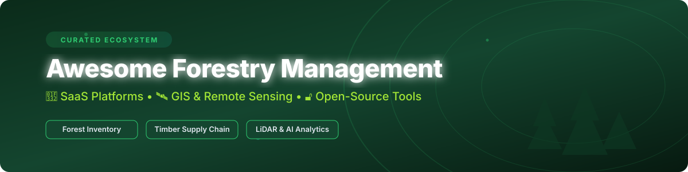

<p align="center">
  <a href="https://github.com/ishandutta2007/Awesome-Forestry-Management">
    
  </a>
</p>

<p align="center">
  <a href="https://github.com/ishandutta2007/Awesome-Awesome-Awesome"></a><a href="https://discord.gg/jc4xtF58Ve"></a>
  <a href="https://github.com/ishandutta2007/Awesome-Forestry-Management/stargazers"></a>
  <a href="https://github.com/ishandutta2007/Awesome-Forestry-Management/network/members"></a>
  <a href="https://github.com/ishandutta2007/Awesome-Forestry-Management/blob/main/LICENSE"></a>
  <a href="https://github.com/ishandutta2007"></a>
</p>

# 🌲 Awesome Forestry Management Software & Tools

## 🌿 Top Forestry Management Platforms & Software Ecosystem

**Curated List of SaaS Products, GIS Tools & Open-Source GitHub Projects for Forestry Management**

*Focused on Forest Inventory, Harvest Planning, Timber Supply Chain, Remote Sensing, LiDAR Analytics, GIS Mapping & Sustainable Forest Operations.*

**Last updated: September 2026**

---

## 📌 Overview & Key Insights

This repository tracks notable **SaaS platforms** and **open-source projects** designed for **Forestry Management**. These digital forestry solutions support forest inventory cruising, growth & yield modeling, harvest scheduling, timber supply chain visibility, satellite/LiDAR remote sensing, and operational spatial planning for commercial, governmental, and conservation forestry.

> [!NOTE]
> **Open-Source vs. Enterprise Commercial Software**: Industrial forestry operations, multi-year wood-flow optimization, and timber supply chain management are dominated by enterprise commercial suites like Trimble Forestry and Remsoft. However, open-source ecosystems like **QGIS** and the FAO **Open Foris** suite lead in field inventory collection, transparent forest monitoring, and satellite remote sensing.

---

## 📑 Table of Contents

- [🏢 SaaS & Commercial Platforms](#-saas--commercial-platforms)
- [🔓 Open-Source GitHub Projects](#-open-source-github-projects)
- [🤝 How to Contribute](#-how-to-contribute)
- [💖 Support & Sponsorship](#-support--sponsorship)
- [📈 Star History](#-star-history)
- [⚠️ Disclaimer](#%EF%B8%8F-disclaimer)

---

## 🏢 SaaS & Commercial Platforms

### 📊 Sector Market Size & Industry Concentration

> 📈 **Market Size & Fragmentation**: The global forestry software and forest management market is estimated at **$2.26 Billion in 2025** and is projected to expand at a **CAGR of ~16.5%** through 2032. The sector is **moderately fragmented**: enterprise industrial planning is concentrated among dominant players (e.g., Trimble, Remsoft), while niche segments (urban forestry, mobile cruising, computer-vision scaling) host active innovation from specialized technology vendors.

### 💼 Commercial SaaS Products Matrix

Below is a curated overview of SaaS products, sorted in descending order by estimated company size/valuation and revenue scale.

| Product | Description | Company Size / Revenue Scale | Starting Price | Free Tier / Trial Limit |
| :--- | :--- | :--- | :--- | :--- |
| **[Trimble Forestry](https://forestry.trimble.com/)** | Enterprise integrated forestry suite covering inventory, log supply, contract management, and mill-to-forest traceability. | **Public ($13.8B+ Market Cap, $3.8B+ Annual Rev)** | $2,500 / module / year | 30-day trial for Trimble Connect/desktop modules |
| **[SilviaTerra (NCX)](https://www.silviaterra.com/)** | High-resolution forest inventory and natural capital carbon exchange platform powered by satellite remote sensing. | **Series B ($50M+ Valuation, ~$12M Revenue)** | $500 / project assessment | Free land eligibility check & carbon plot evaluation |
| **[Remsoft](https://remsoft.com/)** | Spatial forestry planning and harvest scheduling optimization software for forest operations and wood-flow planning. | **Private Enterprise ($15M - $25M Revenue)** | $3,600 / planner seat / year | 14-day full feature interactive demo |
| **[Arbonaut](https://www.arbonaut.com/)** | LiDAR and remote sensing decision-support platform for inventory assessments and forest biomass estimation. | **Mid-Market ($8M - $15M Revenue)** | $1,200 / region contract | 14-day restricted access sandbox |
| **[PlanIT Geo](https://planitgeo.com/)** | TreePlotter platform for urban forestry management, canopy assessment, tree inventory, and municipal arboriculture. | **Growth Stage ($5M - $10M Revenue)** | $750 / year | 14-day free trial on TreePlotter INVENTORY |
| **[Forest Metrix](https://www.forestmetrix.com/)** | Mobile and desktop forest inventory cruising and timber valuation software for field foresters. | **Niche SaaS ($2M - $5M Revenue)** | $1,000 / year (Pro plan) | 28-day (4-week) full feature trial without credit card |
| **[Timbeter](https://www.timbeter.com/)** | Computer-vision mobile log measurement and timber inventory platform for log scaling and pile volume estimation. | **Venture-Backed ($2M - $5M Revenue)** | €125 / month | 10 free timber log measurements |
| **[ForestHQ](https://www.foresthq.com/)** | Digital forest asset inventory, harvest tracking, and operational mapping solution. | **Early Stage ($1M - $3M Revenue)** | $600 / year | 14-day trial for operational logging accounts |

---

## 🔓 Open-Source GitHub Projects

Explore top open-source repositories and analytical tools for forest cruising, LiDAR point cloud processing, geospatial mapping, and growth modeling. Sorted in descending order by GitHub Stars_Counts.

| Open-Source Project | Description | Stars_Badge | Key Capabilities |
| :--- | :--- | :--- | :--- |
| **[QGIS](https://github.com/qgis/QGIS)** | Premier open-source Geographic Information System used worldwide for forest canopy mapping, stand delineation, and spatial GIS planning. | [](https://github.com/qgis/QGIS/stargazers) | Desktop GIS, LiDAR plugins, Raster analysis |
| **[OpenTreeMap / otm-core](https://github.com/OpenTreeMap/otm-core)** | Collaborative urban forestry tree inventory platform for crowdsourced ecosystem services mapping. | [](https://github.com/OpenTreeMap/otm-core/stargazers) | Urban forestry, Tree inventory, Eco-benefits |
| **[USDA Forest Service / FIESTA](https://github.com/USDAForestService/FIESTA)** | R package for evaluating Forest Inventory and Analysis (FIA) sample-based datasets. | [](https://github.com/USDAForestService/FIESTA/stargazers) | Sample estimation, FIA plots, Forest stats |
| **[Open Foris Collect](https://github.com/openforis/collect)** | FAO desktop and mobile survey designer and field collector for national forest monitoring. | [](https://github.com/openforis/collect/stargazers) | Mobile survey, Offline collection, Validation |
| **[Forest-Stack](https://github.com/datakaveri/Forest-Stack)** | Geospatial analytics modules in Python & TypeScript for carbon estimation and forest management. | [](https://github.com/datakaveri/Forest-Stack/stargazers) | Carbon math, Geo-analytics, Cloud pipelines |
| **[Bureau-du-Forestier-en-chef / FMT](https://github.com/Bureau-du-Forestier-en-chef/FMT)** | C++ library with Python/R wrappers for spatial forest management planning and harvest simulation. | [](https://github.com/Bureau-du-Forestier-en-chef/FMT/stargazers) | Spatial optimization, Wood-flow simulation |
| **[rForest](https://github.com/carlos-alberto-silva/rForest)** | R package providing 3D stem visualization, taper equations, and timber inventory metrics. | [](https://github.com/carlos-alberto-silva/rForest/stargazers) | 3D stem modeling, Taper curves, Inventory |
| **[ForAINet](https://github.com/prs-eth/ForAINet)** | 3D deep learning framework for automated forest inventory using high-density airborne LiDAR. | [](https://github.com/prs-eth/ForAINet/stargazers) | Deep learning, Airborne LiDAR, Individual tree detection |
| **[pytreedb](https://github.com/3dgeo-heidelberg/pytreedb)** | Python REST API & database system for storing tree inventory metrics and 3D point cloud data. | [](https://github.com/3dgeo-heidelberg/pytreedb/stargazers) | 3D Database, REST API, Tree metrics |
| **[forestinventory](https://github.com/AndreasChristianHill/forestinventory)** | R package for combining field plot data with remote sensing covariates using multi-phase estimators. | [](https://github.com/AndreasChristianHill/forestinventory/stargazers) | Multi-phase estimation, LiDAR regression |

---

## 🛠️ Typical System Architecture Workflow

```
┌─────────────────────────┐      ┌─────────────────────────┐      ┌─────────────────────────┐
│  Open Foris Collect     │ ───► │  QGIS & Remote Sensing  │ ───► │ Enterprise SaaS         │
│  (Mobile Field Cruising)│      │  (LiDAR & Mapping)      │      │ (Remsoft / Trimble)     │
└─────────────────────────┘      └─────────────────────────┘      └─────────────────────────┘
```

---

## 🤝 How to Contribute

Contributions are warmly welcomed! Please follow these simple steps to contribute:

1. 🍴 **Fork** this repository.
2. 📝 **Add or update** entries in `README.md` following the tabular layout.
3. 🔎 Ensure all entries include: *Name, Link, Feature Details, Pricing/Star metrics, and Category*.
4. 📬 Submit a **Pull Request** with a clear explanation of your additions.

---

## 💖 Support & Sponsorship

If you find this curated list of forestry software and tools helpful, please consider supporting the project!

- 🌟 **Star this repository** on GitHub to increase its visibility.
- 🔀 **Fork and share** it with fellow foresters, researchers, and developers.
- ☕ **Buy me a coffee**: Support ongoing maintenance via [GitHub Sponsors](https://github.com/sponsors/ishandutta2007).

<p align="center">
  <a href="https://github.com/sponsors/ishandutta2007">
    
  </a>
</p>

---

## 📈 Star History

[](https://star-history.dera.page/#ishandutta2007/Awesome-Forestry-Management&type=date&legend=top-left)

---

## ⚠️ Disclaimer

- This list is **community-curated** for educational, scientific, and informational purposes.
- Inclusion of software products or open-source repositories does not constitute an official endorsement.
- Professional forestry practices, local environmental regulations, and silvicultural standards apply to all operations.
